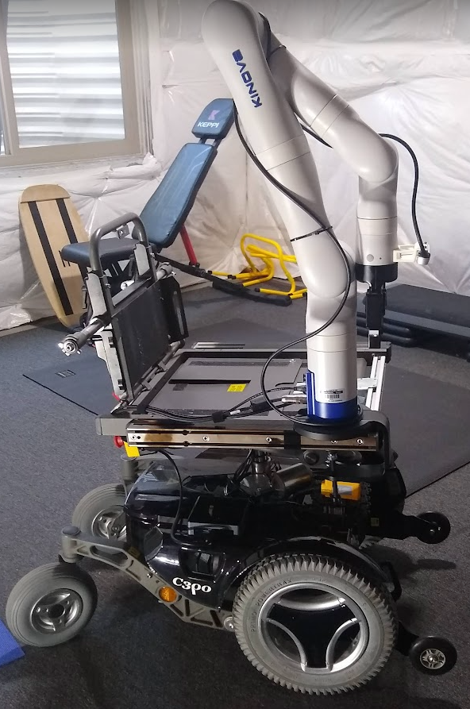
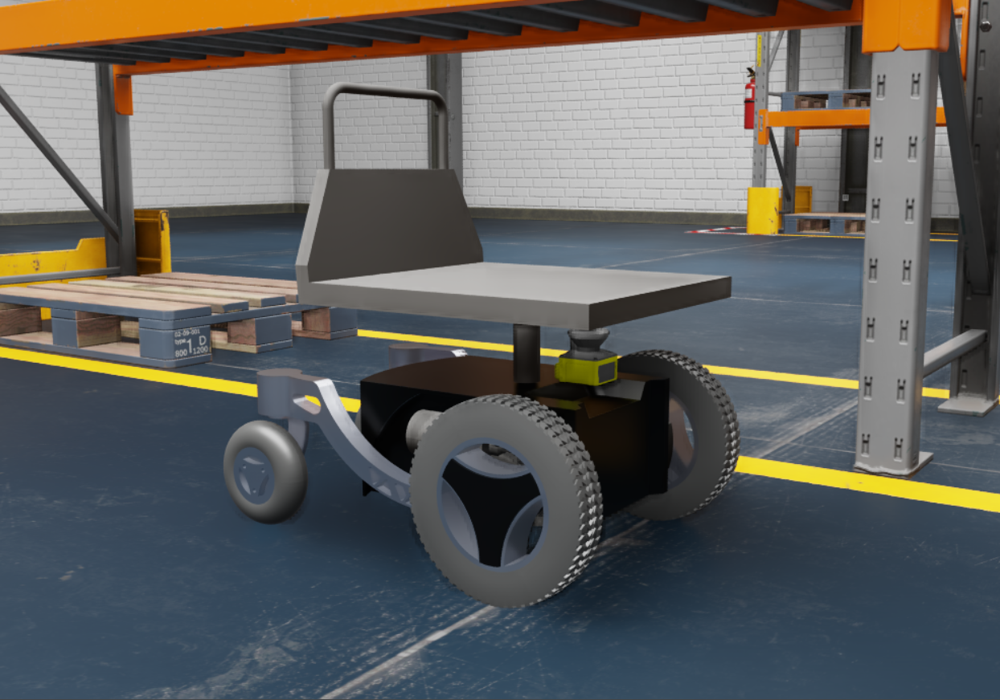

# c3pzero mobile manipulator

Description: This is a ROS 2 package for the C3pzero robot which consists of a Permobile C300 diff drive base and Kinova Gen3 manipulator. This Package support the physical hardware, Ignition Gazebo and Nvidia Isaac simulation.

https://github.com/MarqRazz/c3pzero/assets/25058794/35301ba1-e443-44ff-b6ba-0fabae138205

## Documentation

- [Installation](doc/installation.md)
- [User Guide](doc/user.md)
- [Developers Guide](doc/developer.md)
- [c3pzero Simulation hand hardware Bringup Guide](c3pzero_bringup/README.md)
- [C300 Mobile Base Guide](c300/README.md)
