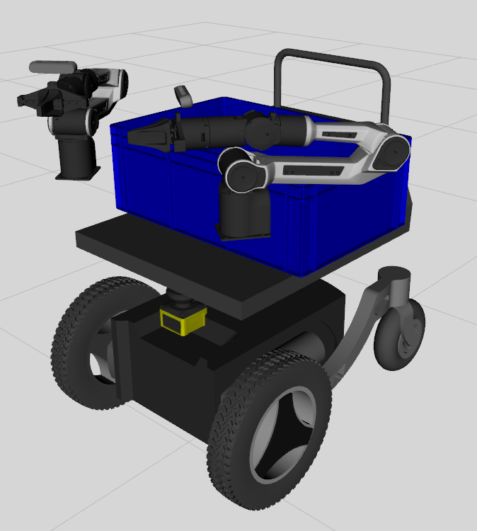

# c3pzero Mobile Robot

## To view the robots URDF in Rviz you can use the following launch file:
``` bash
ros2 launch c3pzero_description view_robot_urdf.launch.py
```



## To start the `c3pzero` mobile robot in Gazebo run the following command:
``` bash
ros2 launch c3pzero_bringup gazebo_c3pzero.launch.py
```

## To test out the controllers in simulation you can run the following commands:

- Arm home pose
``` bash
ros2 topic pub /joint_trajectory_controller/joint_trajectory trajectory_msgs/JointTrajectory "{
  joint_names: [gen3_joint_1, gen3_joint_2, gen3_joint_3, gen3_joint_4, gen3_joint_5, gen3_joint_6, gen3_joint_7],
  points: [
    { positions: [0.0, 0.26, 3.14, -2.27, 0.0, 0.96, 1.57], time_from_start: { sec: 2 } },
  ]
}" -1
```

- Arm retracted pose
``` bash
ros2 topic pub /joint_trajectory_controller/joint_trajectory trajectory_msgs/JointTrajectory "{
  joint_names: [gen3_joint_1, gen3_joint_2, gen3_joint_3, gen3_joint_4, gen3_joint_5, gen3_joint_6, gen3_joint_7],
  points: [
    { positions: [0.0, -0.35, 3.14, -2.54, 0.0, -0.87, 1.57], time_from_start: { sec: 2 } },
  ]
}" -1
```

- GripperActionController (Open position: 0, Closed: 0.8)
``` bash
ros2 action send_goal /robotiq_gripper_controller/gripper_cmd control_msgs/action/GripperCommand "{command: {position: 0.0}}"
```

## To test sending commands directly to Isaac Sim you can run the following commands:
> NOTE: sending command that are far away from the robots current pose can cause the simulation to go unstable and be thrown around in the world.

- Arm home pose
``` bash
ros2 topic pub /isaac_joint_commands sensor_msgs/JointState "{
  name: [gen3_joint_1, gen3_joint_2, gen3_joint_3, gen3_joint_4, gen3_joint_5, gen3_joint_6, gen3_joint_7],
  position: [0.0, 0.26, 3.14, -2.27, 0.0, 0.96, 1.57]
}" -1
```

- Arm retracted pose
``` bash
ros2 topic pub /isaac_joint_commands sensor_msgs/JointState "{
  name: [gen3_joint_1, gen3_joint_2, gen3_joint_3, gen3_joint_4, gen3_joint_5, gen3_joint_6, gen3_joint_7],
  position: [0.0, -0.35, 3.14, -2.54, 0.0, -0.87, 1.57]
}" -1
```
